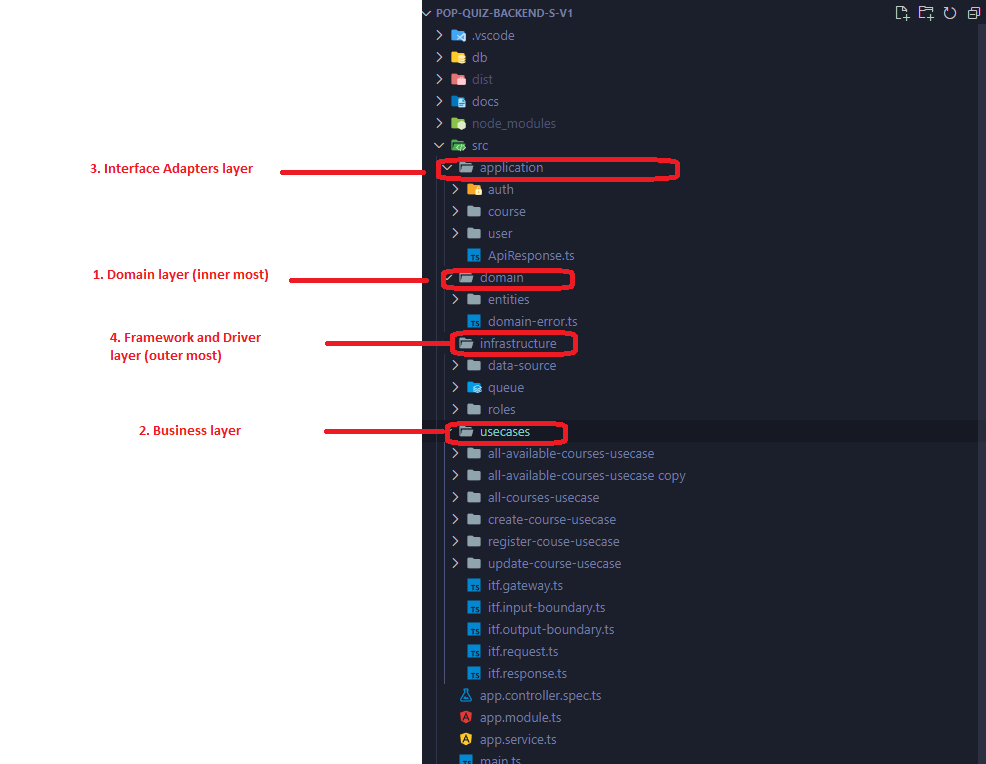
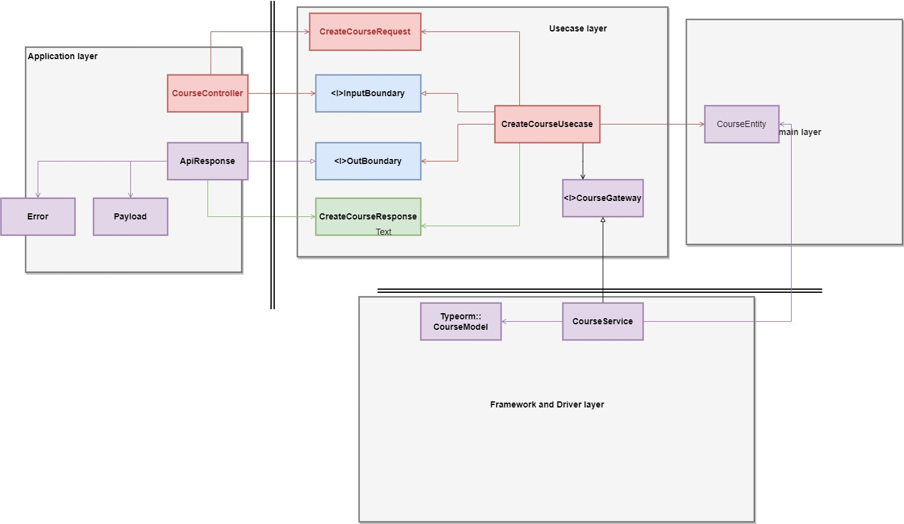

<p align="center">
  <a href="http://nestjs.com/" target="blank"></a>
</p>

[circleci-image]: https://img.shields.io/circleci/build/github/nestjs/nest/master?token=abc123def456
[circleci-url]: https://circleci.com/gh/nestjs/nest

  <p align="center">A progressive <a href="http://nodejs.org" target="_blank">Node.js</a> framework for building efficient and scalable server-side applications.</p>
    <p align="center">
<a href="https://www.npmjs.com/~nestjscore" target="_blank"></a>
<a href="https://www.npmjs.com/~nestjscore" target="_blank"></a>
<a href="https://www.npmjs.com/~nestjscore" target="_blank"></a>
<a href="https://circleci.com/gh/nestjs/nest" target="_blank"></a>
<a href="https://coveralls.io/github/nestjs/nest?branch=master" target="_blank"></a>
<a href="https://discord.gg/G7Qnnhy" target="_blank"></a>
<a href="https://opencollective.com/nest#backer" target="_blank"></a>
<a href="https://opencollective.com/nest#sponsor" target="_blank"></a>
  <a href="https://paypal.me/kamilmysliwiec" target="_blank"></a>
    <a href="https://opencollective.com/nest#sponsor"  target="_blank"></a>
  <a href="https://twitter.com/nestframework" target="_blank"></a>
</p>
  <!--[](https://opencollective.com/nest#backer)
  [](https://opencollective.com/nest#sponsor)-->

## Description

API for the following school registration system. The system should allow students to register for courses and administrators to manage the course offerings and student enrollment

## Architecture
- The system applies Clean Architecture, it's a way to organize code in such that it encapsulates the business logic but keeps it separate from the delivery mechanism. That means the abstraction is not affected if the details are changed.

  - application: entry points of all requests, its role is interface adapters, that convert data from the format most convenient for the use cases and entities, to the format most convenient for REST API like json response
  - domain&entities: encapsulate Enterprise wide business rules
  - usecases: The software in this layer contains application specific business rules. It encapsulates and implements all of the use cases of the system. These use cases orchestrate the flow of data to and from the entities, and direct those entities to use their enterprise wide business rules to achieve the goals of the use case.
  - infrastructures: the outermost layer is generally composed of frameworks and tools such as the Database, the Web Framework, 

- The design follow the rule: The inner surce code dependencies can only point inwards. Nothing in an inner circle can know anything at all about something in an outer circle

### Project folder structure



### Project architecture



## Solution challenges

- Incomming Enroll requests will be pushed to redis queue, which then be processed in transaction by other workers. This way we can improve performance when having concurrent request and concurrency control


## Installation

```bash
$ yarn install
```

## Import database (mysql)

- Import sql file in folder: db/Dump20230313.sql

## Configuration

- Edit .env file

```bash

  NODE_ENV=prod
  API_PORT=3000
  API_PORT_DEBUG=9229
  MYSQL_HOST="localhost"
  MYSQL_PORT=3306
  MYSQL_USERNAME="root"
  MYSQL_PASSWORD="root"
  MYSQL_DATABASE="regov_school"

JWT_SECRET="ndthai1"
```

## Running the app


```bash
# development
$ yarn run start

# watch mode
$ yarn run start:dev

# production mode
$ yarn run start:prod
```

## Test

```bash
# unit tests
$ yarn run test

# e2e tests
$ yarn run test:e2e

# test coverage
$ yarn run test:cov
```
